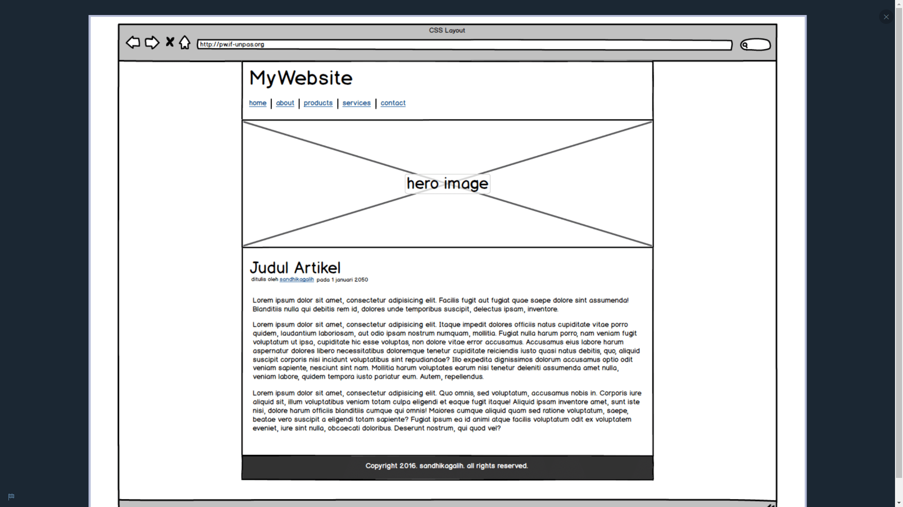
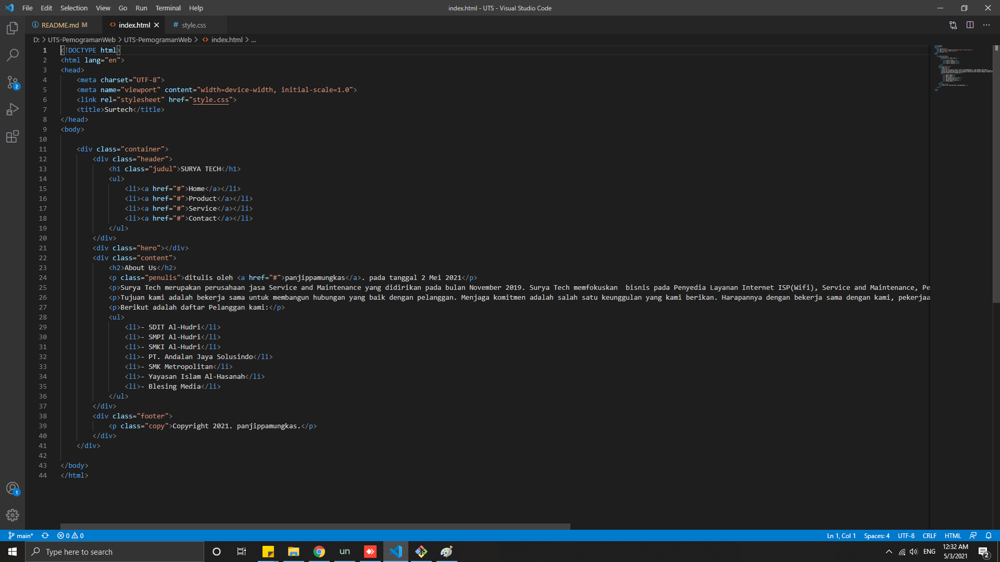
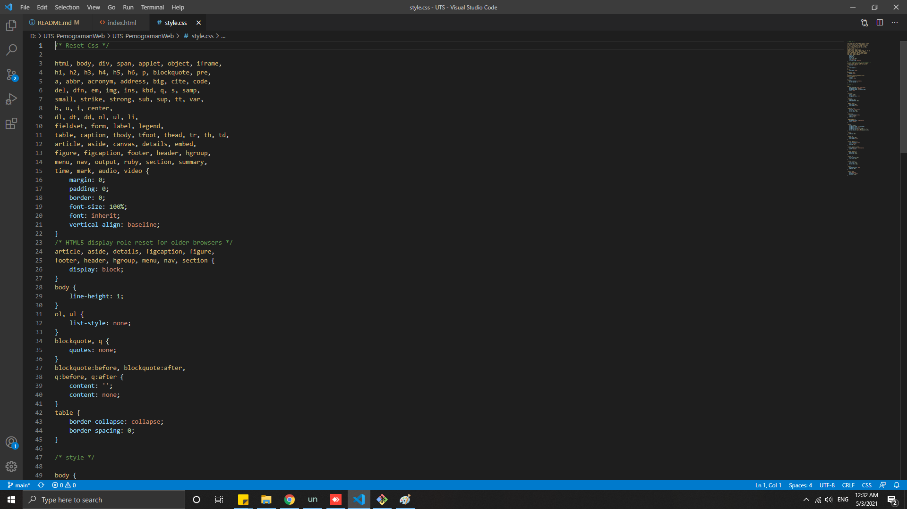
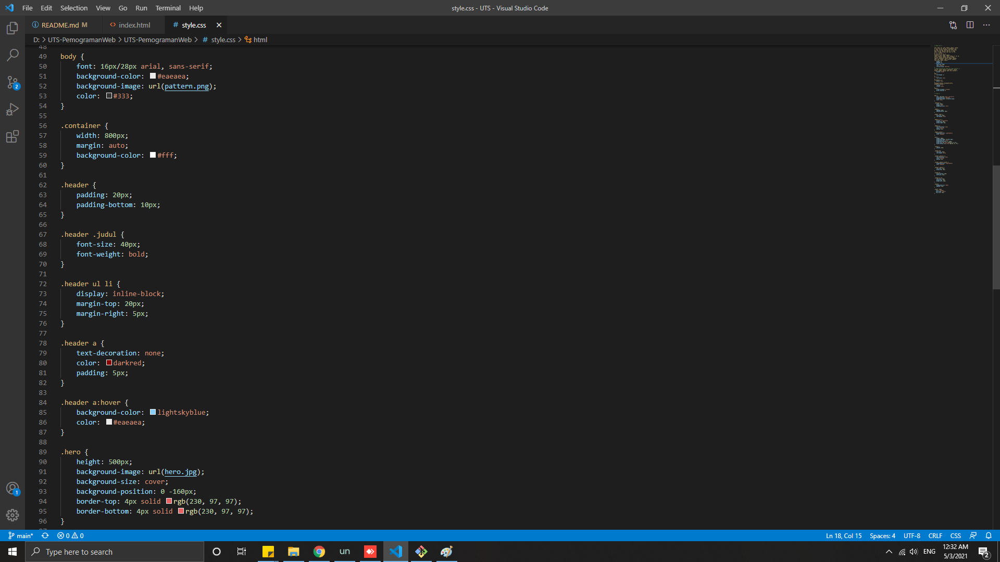
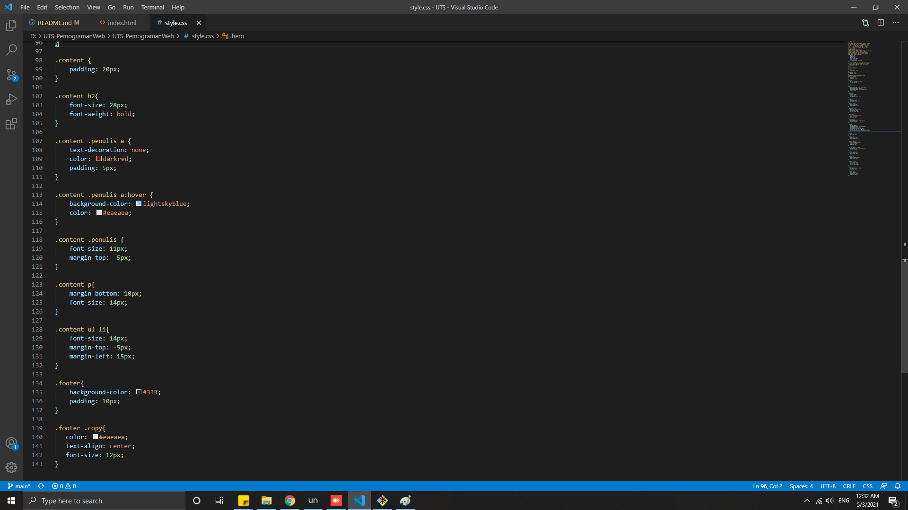
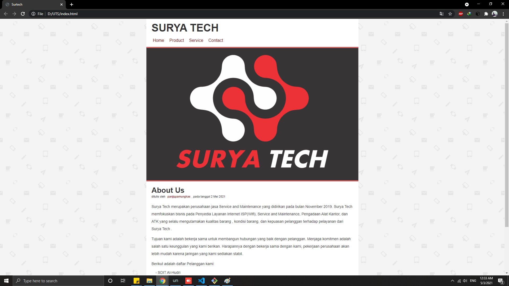
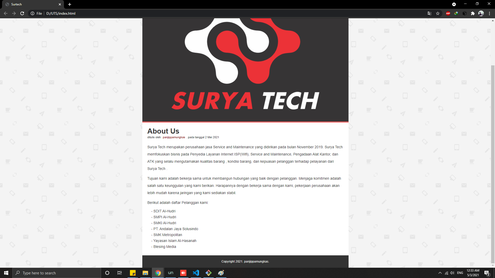

# UTS-PemogramanWeb

### Nama        : Panji Putra Pamungkas
### Nim         : 311910587
### Kelas       : TI. 19. B1
### Mata Kuliah : Pemograman Web - Ujian Tengah Semester

Dibawah ini adalah tampilan dari mockup yang saya gunakan.

untuk url dari mockup nya ada di bawah ini:
https://www.dropbox.com/s/6zpb7nxx61xe0te/latihan-box-model.pdf?dl=0

Code dari html yang saya gunakan

Code css yang saya gunakan

Tampilan dari web yang sudah selesai

